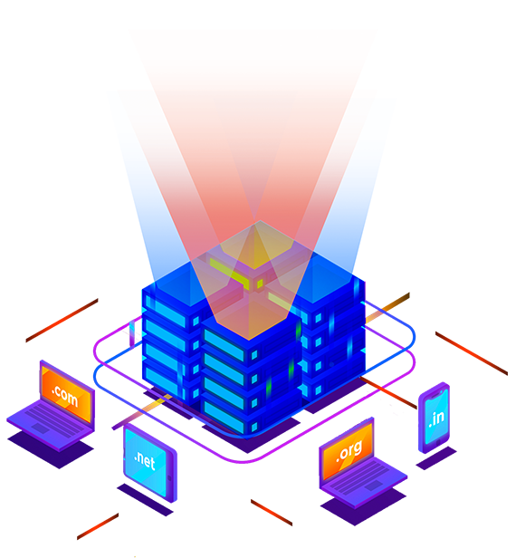

# 🚀 Moshify Landing Page

A modern, responsive cloud hosting landing page built using **HTML**, **CSS**, and **JavaScript**.

This project demonstrates responsive layout design, reusable components, animations, and clean UI structure — created as part of my front-end development portfolio.

---

## 🌐 Live Demo

👉 _(Add after GitHub Pages is enabled)_

---

## 📸 Preview



---

## 🛠️ Technologies Used

- HTML5 (Semantic markup)
- CSS3 (Flexbox & Grid)
- JavaScript (UI interactions)
- AOS Animation Library
- Responsive Design Principles

---

## ✨ Features

- ✅ Fully responsive layout
- ✅ Modern landing page design
- ✅ Animated sections on scroll
- ✅ Component-based CSS structure
- ✅ Mobile navigation menu
- ✅ Optimized images using WebP

---

## 📂 Project Structure

```
moshify-landing-page/
│
├── index.html
├── css/
├── js/
├── images/
└── README.md
```

---

## ▶️ How to Run Locally

1. Clone the repository:

```
git clone https://github.com/kidforeverserkan/moshify-landing-page.git
```

2. Open `index.html` in your browser.

---

## 👨‍💻 Author

**Serkan**

- GitHub: https://github.com/kidforeverserkan

---

## 📄 License

This project is open source and available under the MIT License.
